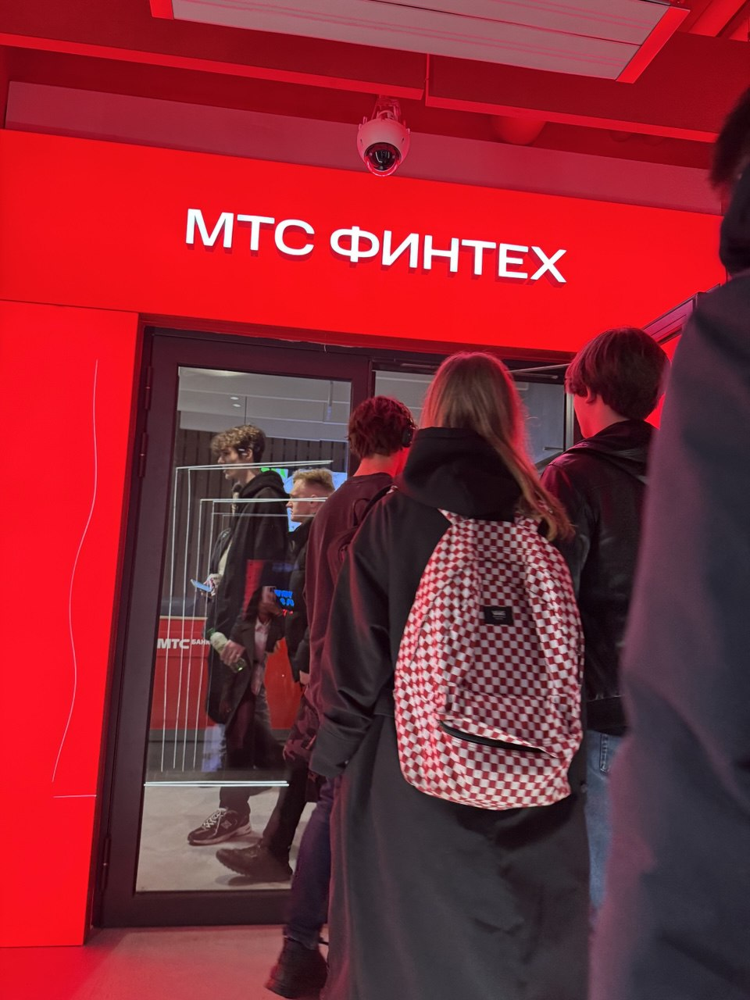
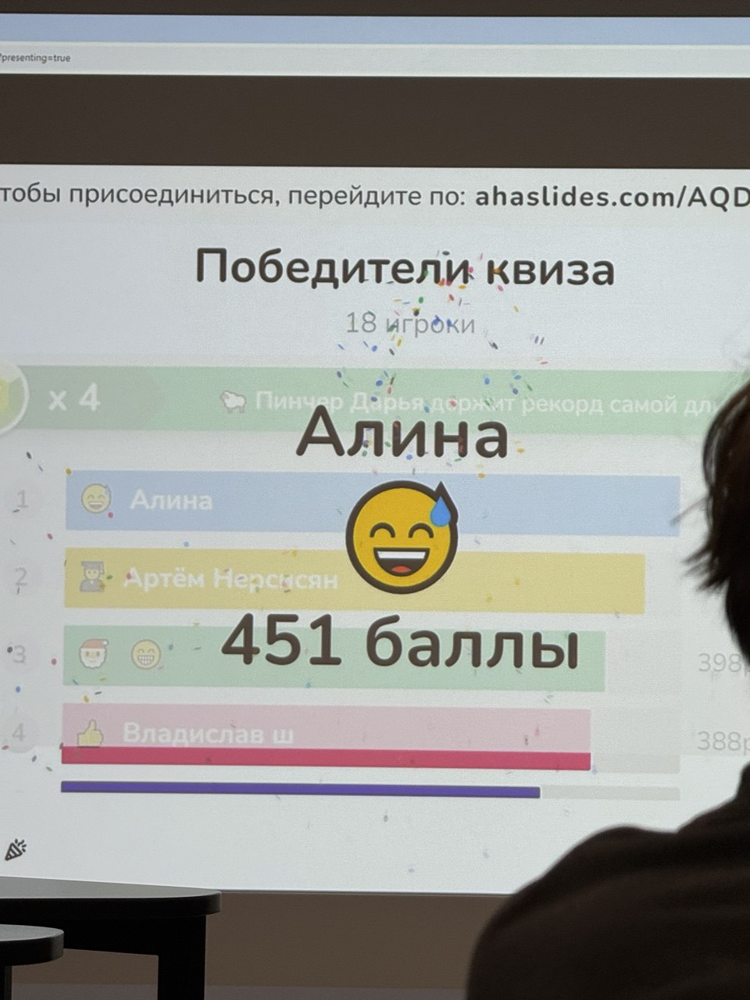
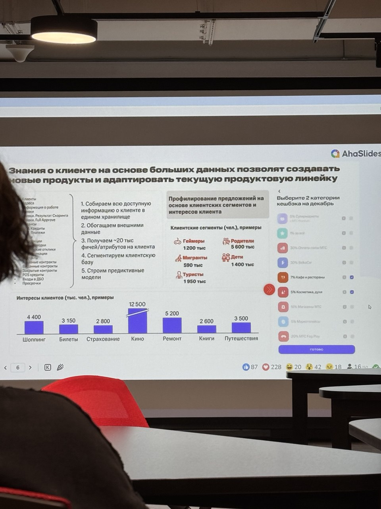
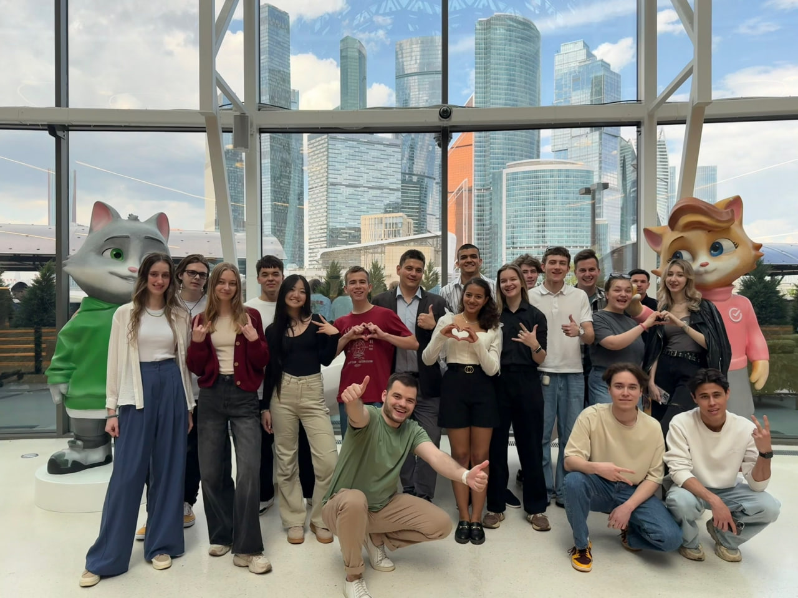
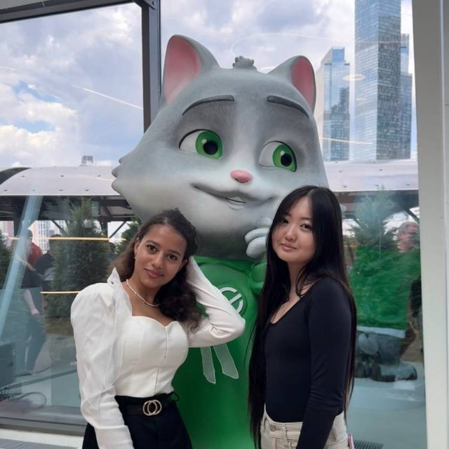

# Взаимодействие с организациями-партнёрами (отчёт по проектной практике)  
**Срок окончания работы над задачей:** 24.05.2025  
**Тема практики:** Применение ИИ в профессиональном обучении  

---

## Экскурсия в МТС-Финтех  

**Дата:** 25.03.2025
**Время:** 16:00  

### Описание мероприятия  
На экскурсии были показаны рабочие пространства основных отделов банка, продемонстрированы решения на основе искусственного интеллекта для финансового сектора. Специалисты компании поделились кейсами использования ИИ:  
- **Автоматизация кредитного скоринга** — алгоритмы анализируют поведенческие паттерны клиентов.  
- **Чат-боты для службы поддержки** — NLP-модели обрабатывают запросы на естественном языке.  
- **Мониторинг мошеннических операций** — предиктивная аналитика на основе ML. 
-  **Персонализация контента, адаптация текущей продуктовой линейки под потребности рынка** (см. фотографии)

Также по усвоенному материалу был проведен квиз с подарками, на котором представитель от нашей команды (Каматали Алина) заняла первое место. 

Фотография с призами от МТС-Финтех

#### Полученные знания  
- Практическое применение ИИ в финтехе.  
- Важность качества данных для обучения моделей.  
- Интеграция ИИ-решений с legacy-системами. 
- ИИ как инструмент маркетинга.

 
Фотография слайда с мероприятия

## Экскурсия в центральный аппарат Сбербанка (Москва-Сити)  

**Дата:** 23.05.2025 
**Время:** 14:00  

### Примеры внедрения ИИ  
- **Виртуальные ассистенты** для сотрудников (например, "СберКот" см фотографии).  
- **AI-аналитика больших данных** — прогнозирование рыночных трендов.  
- **Автоматизированные системы проверки документов** (Computer Vision).

  

---

### Связь с проектной практикой  
Наш проект **"Применение ИИ в профессиональном обучении"** направлен на разработку комплексных методических рекомендаций по интеграции ИИ-технологий в корпоративные обучающие системы и академическую среду. Посещение организаций-партнёров предоставило нам уникальную возможность изучить реальные кейсы внедрения ИИ в бизнес-процессы, что имеет непосредственное значение для нашей работы.
Ключевые взаимосвязи:

1) **Практическая верификация теоретических моделей**
Увиденные на примере МТС-Финтех и Сбербанка решения подтвердили эффективность наших методических подходов к:
- автоматизации образовательной аналитики
- персонализации учебных траекторий
- созданию интеллектуальных ассистентов

2) **Обогащение методической базы**
Полученные в ходе экскурсий данные позволят:
- дополнить рекомендации конкретными примерами успешных внедрений
- разработать реалистичные сценарии обучения
- создать классификатор типовых ошибок при имплементации ИИ
- Актуализация технологического стека

### Планируемые улучшения проекта:
- Включение кейсов партнёров в методические материалы
- Адаптация лучших практик для образовательного контекста
- Разработка чек-листов оценки зрелости ИИ-решений
- Создание библиотеки шаблонов для быстрого старта внедрения

---

### Заключение  
Обе экскурсии предоставили практическое понимание внедрения ИИ в корпоративные процессы, расширили кругозор.
После встеч с партнёрами Московского Политеха, мы узнали, что в бизнесе ИИ может использоваться для:
- Улучшения функционала проекта/продукта.  
- Прототипирования MVP.
- Персонализации и лучшего понимания целевой аудитории.
- Анализа больших данных.
- Привлечения большего числа клиентов путём разработки ИИ чатбота (Пример: Gigachat от СберБанк).   
Полученные знания дополнили наши профессиональные компетенции и помогли в разработки методических материалов по использованию искусственного интеллекта в профессиональном обучении.

